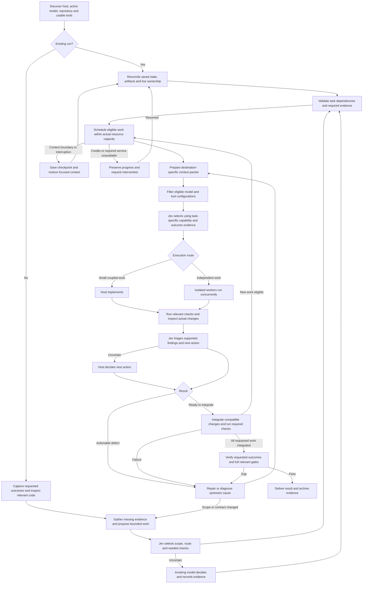

# Proposed design: Amale

The interactive HTML design in [DESIGN.html](DESIGN.html) is now the primary review artifact. This Markdown file is retained as the earlier text reference. Later refinements in the HTML supersede this reference: Jev routes every task, GLM/DeepSeek latest stable Flash models perform routine work, and Kimi K3 is selected for justified deeper work. Cross-model fresh review and the proposed bounded escalation policy are detailed in REVIEW-POLICY.md and the HTML Review & escalation view.

Status: ready for shared-understanding review, not implemented.
Date: 2026-09-19

## Outcome

A reusable skill and TypeScript runtime that carry an authorized coding task to verified completion across Codex and Claude. The invoking model remains the coordinator. pi/OpenRouter supplies configurable task-specialist model pools, with DeepSeek-first general implementation. Jev makes bounded semantic decisions using supplied model evidence; deterministic code owns valid execution.

The workflow optimizes for correct completed outcomes, elapsed time, and total token cost. Phase completion, reviewer approval, smaller context, and worker reports are intermediate signals rather than success criteria.

## Settled operating policies

- Jev selects among evidence-backed options at explicit decision points. Host models research, propose, implement, and diagnose. Uncertain Jev decisions fall back to the host with a recorded reason.
- The host can implement small coupled changes. Independent substantial work can run concurrently in isolated workspaces, subject to actual host/tool capacity and resource conflicts.
- General implementation defaults to the skill-local DeepSeek pool. Frontend creation, visual inspection/review, research, and mathematical reasoning have separately configurable model pools, tools, and verification requirements. Global pi defaults are preserved.
- Continue until completion. Track consumption without an artificial spending cap. Bounded retries handle transient failures; exhausted credits or a persistent service failure requiring user intervention produce a durable checkpoint.
- A proposed safeguard or abstraction must cite a requirement, observed failure, or demonstrably reachable failure path. Speculative future capabilities do not enter the task by default.
- Routine test failures, review findings, task boundaries, and context limits do not require user confirmation. Existing user authorization remains effective. Actual permission boundaries remain enforced.

## Execution graph

Jev decisions throughout the graph use the same uncertainty fallback. Checkpointing and service-failure handling apply to every executing node, not only scheduling. The diagram does not impose mandatory phases on each change: small work traverses a compact route; independent work starts when its own dependencies are satisfied.

## Work and verification

Decompose by cohesive changes and dependencies, not one task per file. Use the smallest plan that captures requested outcomes, ownership, dependencies, and checks. Code validates graph IDs, dependency references, cycles, and transitions.

Each isolated worker checks the behavior it changes. Required full integration gates run on the integrated result. Reuse evidence only while the relevant content and configuration remain unchanged. Resource ownership serializes conflicting edits, shared services, or database operations while unrelated tasks proceed.

Review is proportional to the actual change. Findings must identify affected behavior, evidence, and a concrete correction. Re-review focuses on changed findings and affected behavior. Repeated failures cause a different diagnosis, worker, or plan rather than an endless identical repair loop. A loop bound triggers rerouting; it does not silently declare completion.

For a customer-charge change, verify the actual amount calculation and reachable payment behavior against explicit expected outcomes. Include concurrency or retry behavior when the inspected system exposes those paths. Do not invent a larger payment system to justify defensive code.

## Durable state and context

Store run state, decisions, task ownership, artifact references, and verification receipts under a neutral project directory. Use atomic state writes and an append-only decision/event record. Checkpoint before handing work off or changing execution context.

Archive original tool outputs before filtering. Context packets retain the current user intent, applicable constraints, accepted decisions, active task, unresolved errors, next action, and evidence references. They retrieve content by destination: implementer, reviewer, integrator, or resumed host. Jev sees actual relevant excerpts when choosing optional context. Filtering does not delete the only copy of evidence.

Adapt the useful paired-message/verbatim-selection ideas from fast-jev-compaction. Do not adopt its assumption that every tool can be rerun or that status and length are enough to judge result contents. Preserve license attribution if substantial code is reused. Cache decisions only for unchanged evidence, questions, model, and destination.

## Jev applications in the initial implementation

Use a small shared decision interface for route/model selection, evidence relevance, scope justification, finding triage, and completion-claim support. Batch independent questions over the same relevant state. Validate responses at runtime and tie each decision to the state revision it evaluated.

Deterministic checks remain responsible for exact arithmetic, exit codes, content hashes, permissions, resource conflicts, dependencies, and live ownership. Jev cannot override a failed required test or approve an unauthorized action.

Do not initially add an autonomous optimization framework. Improvements from completed-run data can be evaluated later when actual failures and labels exist.

## Task-specialist model routing

The user refined the earlier DeepSeek-first choice: it applies to general implementation, not every task. Define configurable roles for general coding, frontend creation, visual QA, asset inspection, research, and mathematical reasoning. A specialist combines a model, relevant tools, a focused brief, and appropriate acceptance evidence. A vision-capable model without screenshots cannot perform visual QA; a research model without retrieval cannot establish current facts.

Give Jev a compact shortlist of model evidence cards. Each records exact model/provider identity, actual access channel, tools/modalities/context limits, supported effort settings, sourced task-performance evidence, verification date, current prices, provider performance, and local outcome counts with sample sizes. Keep vendor claims, independent measurements, user preferences, and local observations distinct. Unknown performance remains unknown.

Code excludes candidates without required access, context, tools, or modalities. Jev evaluates task fit and evidence sufficiency and chooses among eligible configurations under a quality-first policy. Code calculates cost and latency estimates; Jev receives those estimates rather than doing arithmetic. Cheapest tokens, fastest response, and best task result are different objectives. Favor adequate quality and expected cost/time to a verified result, including retries, tool use, and handoff overhead. No artificial spending cap is introduced.

Model selection and provider selection are separate. After a model is selected, use verified OpenRouter provider capabilities and price/performance preferences. Required parameters must actually be supported. Record the resolved provider/model; do not silently strip image inputs, ignore tool requests, or substitute a cheaper incompatible model.

Initial candidates and uncertainties are documented in MODEL-ROUTING.md. They are configurable starting hypotheses, not a permanent ranking. Refresh catalog facts at run initialization or when stale/unavailable; keep a dated cache instead of researching the whole catalog before every dispatch. Evaluate representative tasks through the actual pi/OpenRouter route. Store simple outcome statistics; do not add training infrastructure or automatic benchmark sweeps.

Preserve provider-specific conversation requirements across compaction. In particular, Kimi K3 documents preservation of assistant reasoning/tool-call fields. Host adapters must not reduce every model's history to a generic text-only transcript.

## Host and runtime integration

- Keep one canonical skill in this workspace, with the proposed neutral name `amale`.
- TypeScript source; Bun is the preferred runtime, Node is the fallback. Use platform APIs for paths, subprocess arguments, and configuration. Verify all selected dependency versions against authoritative stable releases before implementation.
- Resolve the invoking model through supported host context/hooks. Preserve the actual model rather than mapping every Claude session to a fixed model. Explicit configuration handles a host that cannot expose the model.
- Launch pi workers with per-invocation provider/model settings and structured results. Record resolved provider/model identity. Do not edit the user's global pi model selection.
- pi extension: supported context-filtering and compaction events.
- Claude/Codex adapters: supported lifecycle checkpoints and context restoration. Enable replacement of native compaction only if the installed host exposes and passes a verified compatible interface; otherwise use the documented checkpoint approach.
- Installer creates Claude and Codex skill links to the canonical source, leaves existing Trellis untouched, detects conflicting targets, and supports safe reruns. Hook/extension registration is separate from a skill link and respects host trust requirements.

## Acceptance evidence

1. A completed short task unlocks its dependent while an unrelated long task is still running.
2. Coupled file changes stay together; conflicting resources serialize without stopping unrelated work.
3. Jev uncertainty leads to a logged host decision and continued work.
4. Resume preserves completed work, does not steal a live worker, and recovers pending operations.
5. Context filtering retains constraints and makes omitted evidence retrievable, including through repeated compaction.
6. Unsupported speculative changes are rejected while demonstrated failures remain actionable.
7. Required failed checks prevent completion; worker prose cannot override evidence.
8. Credit exhaustion checkpoints the run and resumption continues it without starting over.
9. Bun and Node execute the same core behavior; platform-specific installation/process behavior is checked and any untested platform is identified explicitly.
10. Measure elapsed time, total input/output tokens, retries, repeated checks, and actual completed outcomes on representative tasks. Do not claim improvement from mocks or compression ratios alone.
11. Task-specialist configuration can select different models for frontend creation and visual review, and can route image tasks only to an image-capable model plus compatible tools/provider.
12. Unknown or stale model-performance evidence cannot turn into a fabricated capability score. Jev uncertainty falls back to the host; required provider conversation fields survive supported context transformations.

## Remaining factual verification

The Jev full-site audit is incomplete because documentation inventories were inaccessible. Before finalizing the integration, finish reachable relevant API/SDK/model documentation and record remaining inaccessible pages honestly. Verify current published package versions, live configured model availability, authentication availability without printing secrets, and installed hook behavior. Research findings are in RESEARCH.md.
